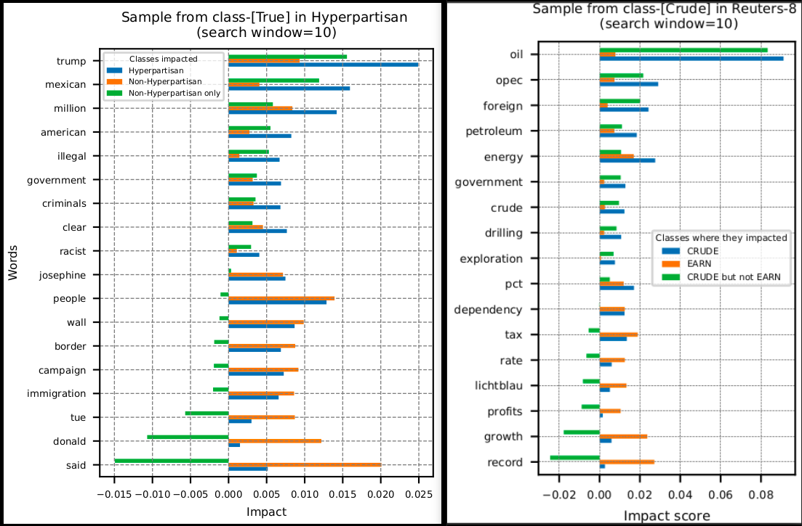

# AChorDS-LVQ: Adaptive Chordal subspace-based LVQ

Welcome to the repository for AChorDS-LVQ!

## What is AChorDS-LVQ?

It is a novel approach to text classification and image-set classification, offering intrinsic interpretability. It treats each text/image-set as a point on the Grassmann manifold, representing the set with a subspace derived through Singular Value Decomposition (SVD). During training, GRLGQ learns a collection of subspace prototypes and relevance factors. These prototypes capture typical behaviours within classes, while the relevance factors identify the most discriminative principal vectors or words/images crucial for the classification task.

## Prerequisites

#### General

- Python 3
- PyTorch >= 1.5 and <= 1.7!
- Optional: CUDA

#### Required Python Packages:

- numpy
- pandas
- opencv
- tqdm
- scipy
- matplotlib

## Implementation Options:

In this repository, we offer the implementations of the AChorDS-LVQ method that leverages PyTorch to create a model class. This implementation offers additional functionalities and integration with the PyTorch ecosystem. 


## Training a ProtoTree

First, you need to create a folder `./run_prototypes`.

The GRLGQ can be trained by running `training.py` with arguments.

An example for ETH-80: 

```bash
training.py --nepochs 500 --log_dir ./run_prototypes --dataset ETH-80 --dim_of_subspace 10 --num_of_protos 1 --lr_protos 0.05 --lr_rel 0.0001 --batch_size_train 1 --cost_fun identity --milestones 100,200,300,400,500
```

To speed up the training process, the number of workers of the DataLoaders can be increased by setting num_workers to a positive integer value (a suitable number depends on your available memory).

### Monitoring Training Progress:

To keep track of the training progress, please check the `--log_dir`. This directory contains several essential files:

- `log_epoch_overview.csv`: This file provides a comprehensive overview of each epoch, including the test accuracy, mean training accuracy, and the mean loss.
- `log_train_epochs_losses.csv`: Here, you'll find detailed information about the loss value and training accuracy for each batch iteration.
- `log.txt`: Additional information is logged in this file to aid in monitoring and troubleshooting.


# Explainability

## Text classification

Note that the model explains its decisions by reporting the effect of each word on its decisions. Thus, one can easily see which words have the highest impact on its decisions.

In the following, we visualize the most influential words on model's decisions for two data sets:
- left: hyperpartisan
- right: Reuters-8,




## Image-set classification

In the following, we visualize the most influential images/pixels on the model decision for an example image-set from ETH-80 data set.
- top: four images with the most impact (above numbers represent the impact of each image)
- bottom: heatmaps encodes the influence of each pixel within images.

   


## Reference:

When citing our work, please refer to the following article:

`
TODO
`

Please use this article as the primary reference for our methodology and approach. If you need further details or clarification, don't hesitate to reach out.

